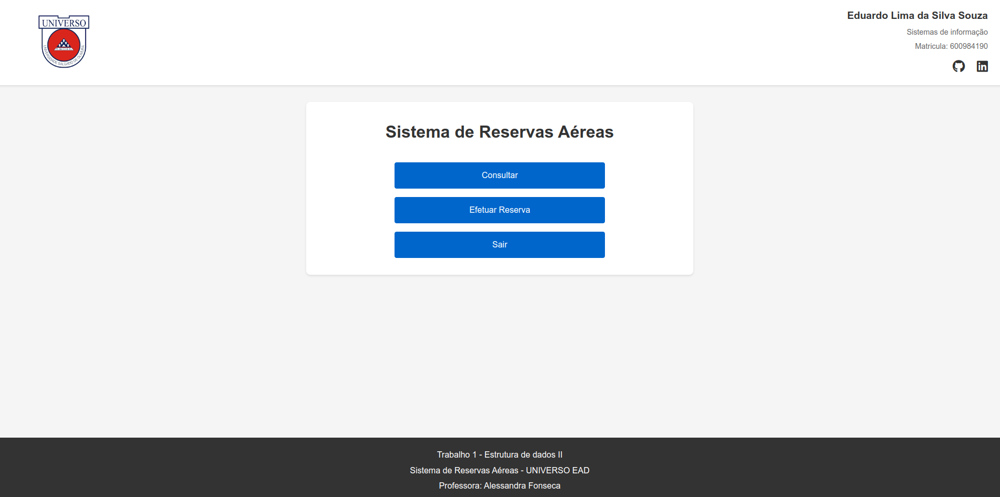

# Sistema de Reservas Aéreas
> Trabalho 1 - Estrutura de dados II



## 📝 Descrição
Trabalho desenvolvido para a disciplina de Estrutura de Dados II do curso de Sistemas de Informação da UNIVERSO EAD, sob orientação da Professora Alessandra Fonseca.

## 🎯 Objetivo
Sistema para efetuar reserva de passagens aéreas de uma companhia, implementando as seguintes funcionalidades:

- Consulta de voos por diferentes critérios:
  - Por número do voo
  - Por origem
  - Por destino
- Efetuar reserva com validações:
  - Confirmação de reserva caso exista o voo e lugar disponível
  - Aviso de "voo lotado" caso não existam lugares disponíveis
  - Aviso de "voo inexistente" caso o código não exista
- Sistema gerencia 12 lugares para cada voo

## 🚀 Tecnologias Utilizadas
- HTML5
- CSS3
- JavaScript (ES6+)

## 🛠️ Como executar o projeto

1. Clone o repositório
```bash
git clone https://github.com/EduSouza-programmer/sistema_de_reservas_aereas-AF-UniversoEAD.git
```

2. Navegue até o diretório do projeto
```bash
cd sistema-reservas-aereas
```

3. Abra o arquivo index.html em seu navegador
```bash
# No Windows
start index.html

# No Linux
xdg-open index.html

# No MacOS
open index.html
```

## 👨‍💻 Autor
Eduardo Lima da Silva Souza
- Matrícula: 600984190
- Curso: Sistemas de Informação
- GitHub: [@EduSouza-programmer](https://github.com/EduSouza-programmer)
- LinkedIn: [Eduardo Souza](https://www.linkedin.com/in/eduardosouzaprogrammer/)

## 📋 Informações do Trabalho
- **Disciplina**: Estrutura de dados II
- **Professora**: Alessandra Fonseca
- **Instituição**: UNIVERSO EAD

## 📄 Licença
Este projeto está sob a licença MIT. Veja o arquivo [LICENSE](./LICENSE) para mais detalhes.

---

<div align="center">
 Feito com ❤️ por Eduardo Lima
</div>